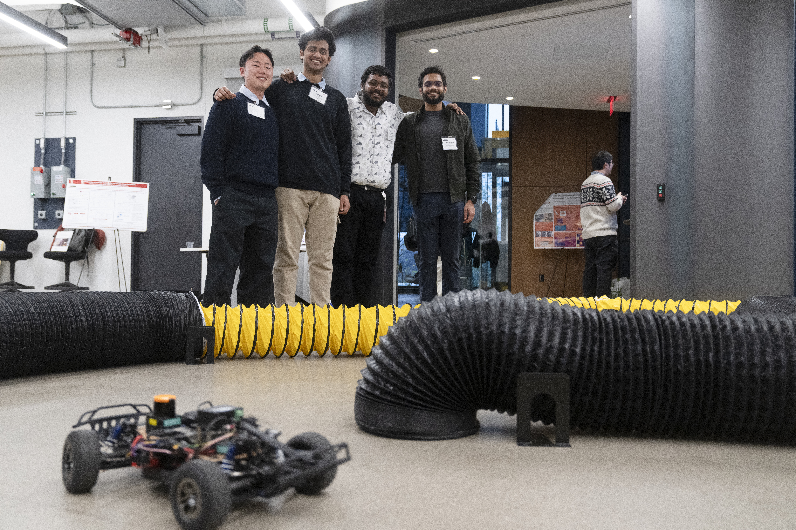
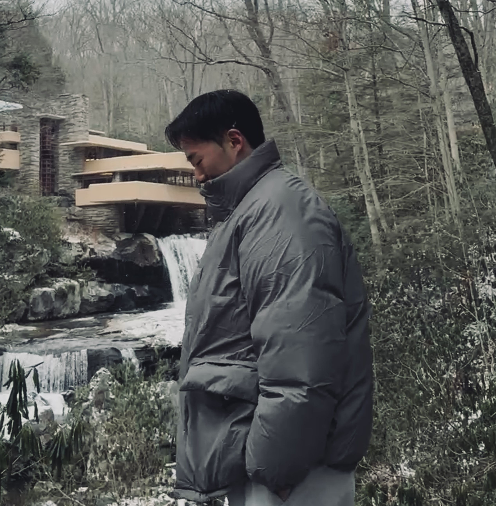

## Hi there 👋

I’m a Master’s student in Mechanical Engineering at Carnegie Mellon University. I’m currently part of the [Intelligent Control Lab](http://icontrol.ri.cmu.edu/) at the Robotics Institute, where I’m fortunate to be advised by Prof. [Changliu Liu](https://scholar.google.com/citations?user=vvzAfOwAAAAJ&hl=en). Before coming to CMU, I earned my B.S. in Mechanical Engineering from Kyungpook National University in South Korea. During my undergraduate years, I worked on autonomous driving research in the [VOICE Lab](https://sites.google.com/view/voice-lab), advised by Prof. [Kyoungseok Han](https://scholar.google.com/citations?user=CEEipNoAAAAJ&hl=en&oi=ao).

## Interests

My research interests lie at the intersection of control, machine learning, optimization, and robotics. I'm particularly interested in developing methods that enable robots to act both safely and intelligently in complex environments. Recently, my work has focused on combining safe control techniques with learning-based approaches to improve the performance and reliability of autonomous systems.

## Research
<!-- -------------------------------- SPARK -------------------------------- -->
<table class="project-table" style="width: 100%; height: 180px;">
  <tr onmouseout="project2_stop()" onmouseover="project2_start()" style="border: none;">
    <td style="padding:16px 16px 16px 0; width:25%; vertical-align:middle; border: none;">
      

        

          <video width="100%" muted autoplay loop>
            <source src="assets/research/spark_thumbnail.mp4" type="video/mp4">
          </video>
        

        
      

    </td>
    <td style="padding:8px;width:75%;vertical-align:top; border: none;">
      

        

          <a href="https://intelligent-control-lab.github.io/spark/">
            SPARK: A Toolbox for Safe Humanoid Autonomy and Teleoperation
          </a>
           
          

            
              Yifan Sun, Rui Chen, Kai S. Yun, Yikuan Fang, <strong>Sebin Jung</strong>, Weiye Zhao and Changliu Liu
            
             
            <em>arXiv</em>, 2025
             
            

              <!-- <a href="#" class="btn btn-primary"><strong>Project Page</strong></a> -->
              <a href="https://arxiv.org/pdf/2502.03132" class="btn btn-info"><strong>arXiv</strong></a>
            

          

        

        

          

            SPARK is a modular toolbox designed to ensure safety in humanoid robot autonomy and teleoperation. It integrates state-of-the-art safe control methods into a flexible framework that supports safety customization across tasks and environments.
          

        

      

    </td>
  </tr>
</table>

<!-- -------------------------------- SPARK -------------------------------- -->

## Projects
<!-- -------------------------------- F1Tenth Safety 21 -------------------------------- -->
<table class="project-table" style="width: 100%; height: 180px;">
  <tr onmouseout="project1_stop()" onmouseover="project1_start()" style="border: none;">
    <td style="padding:16px 16px 16px 0; width:25%; vertical-align:middle; border: none;">
      

        

          <video width="100%" muted autoplay loop>
            <source src="assets/projects/safety21.mp4" type="video/mp4">
          </video>
        

        
      

    </td>
    <td style="padding:8px;width:75%;vertical-align:top; border: none;">
      

        

          <a href="https://intelligent-control-lab.github.io/spark/">
            F1Tenth Racing Demo at Safety21
          </a>
           
          

            
              <strong>Sebin Jung</strong> with Kai S. Yun, Abhinandan Vellanki, Anirudh Shrihari, Kailash Jagadeesh, Wenli Xiao
            
             
            Pittsburgh, PA, 2024
             
            

              <!-- <a href="#" class="btn btn-primary"><strong>Project Page</strong></a> -->
              <a href="https://safety21.cmu.edu/2024-deployment-partner-consortium-symposium/" class="btn btn-info"><strong>Website</strong></a>
            

          

        

        

          

            As part of the Safety21 event, our team presented a live demonstration of autonomous racing using two F1Tenth vehicles. This showcase highlighted the F1Tenth: Autonomous Racing course offered at the Carnegie Mellon Robotics Institute, led by Professor John Dolan.
          

        

      

    </td>
  </tr>
</table>

<!-- -------------------------------- F1Tenth Safety 21 -------------------------------- -->

<!-- 
This is a [link](http://google.com). Something *italics* and something **bold**.

Here is a table

Year | Award | Category
-----|-------|--------
2014 | Emmy  | Won Outstanding Lead Actor in a miniseries or a movie
2015 | BAFTA | Nominated for Best Leading Actor for Sherlock
2014 | Satellite | Won Best Actor miniseries or television film

Here is a horizontal rule

---

Here is a blockquote

> To a great mind, nothing is little
 -->

<!-- ## Publications

1. F.Bar, J.Doe: Effects of having a placeholder of a name
2. S.Holmes, J.Watson: Consequences of living with a sociopath in London

## References

* Foo Bar: Head of Department, Placeholder Names, Lorem
* John Doe: Associate Professor, Department of Computer Science, Ipsum -->

## Recent Activities

  <button class="glider-prev">«</button>
  

    

    

    

  

  <button class="glider-next">»</button>

<!-- Glider.js init -->

