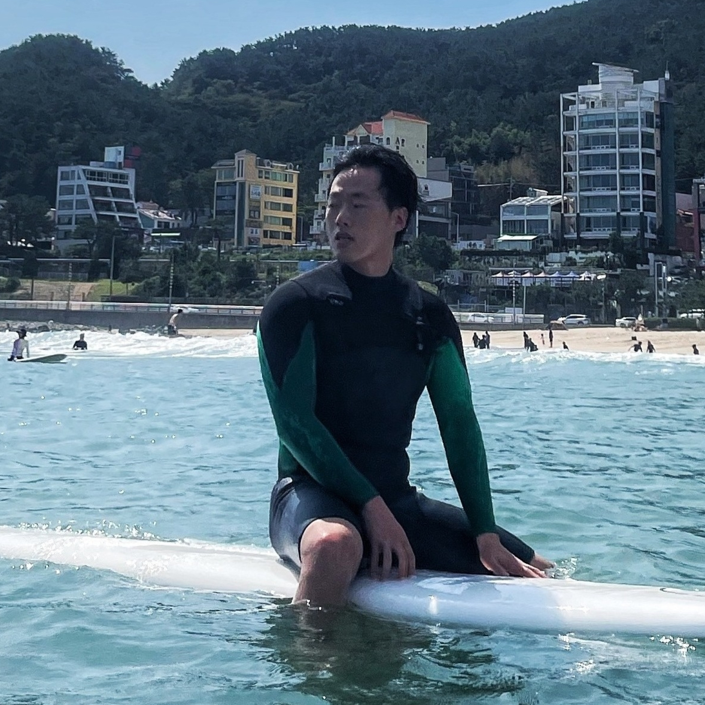
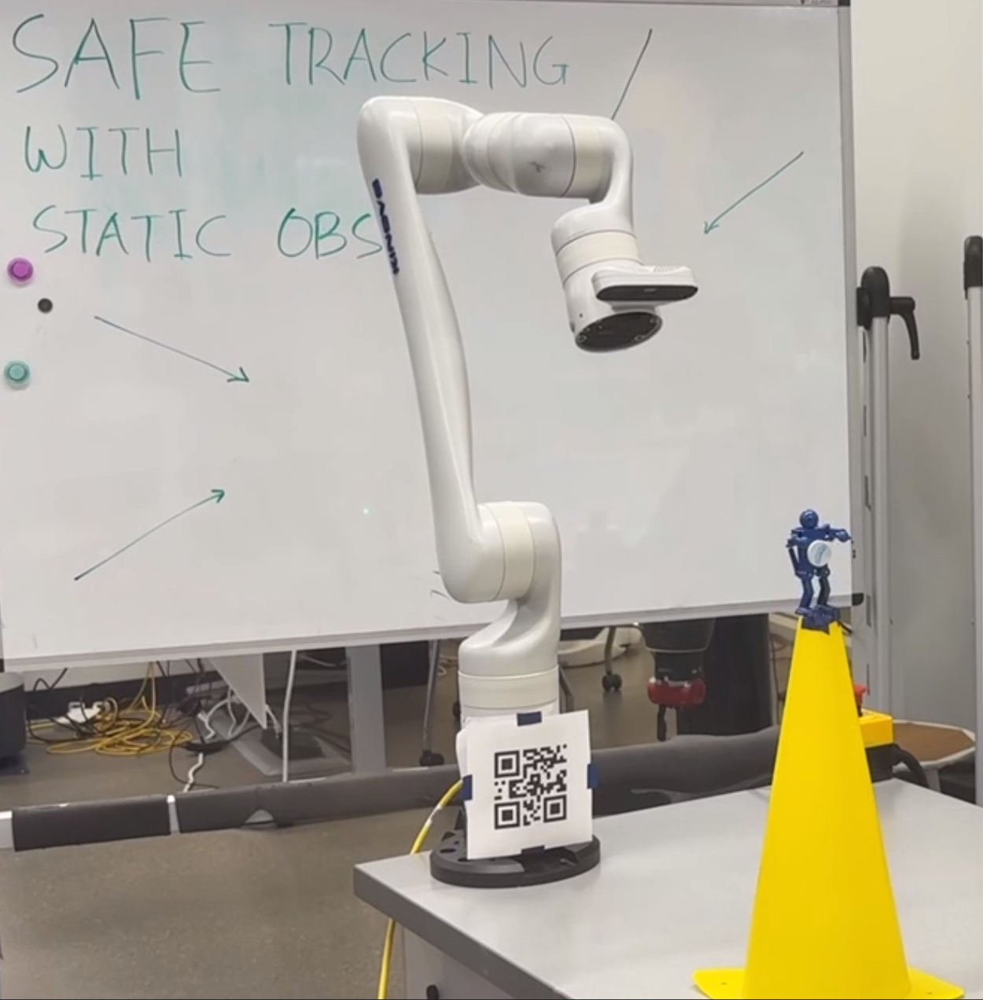
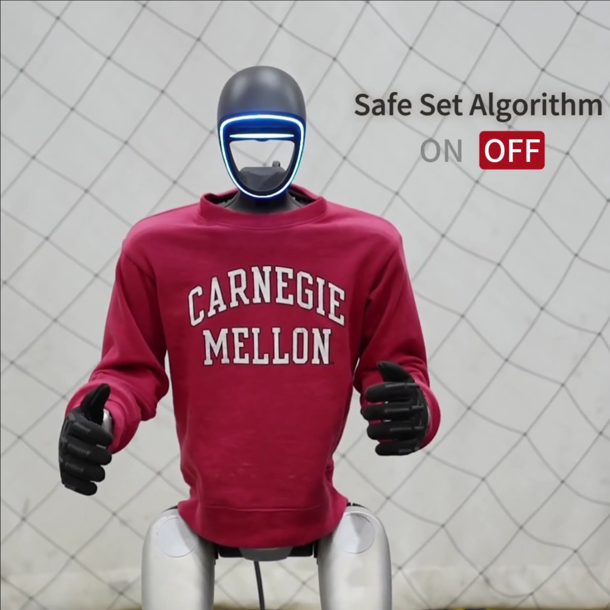
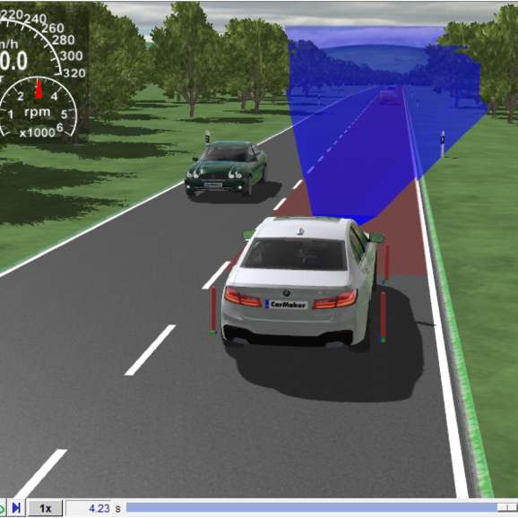
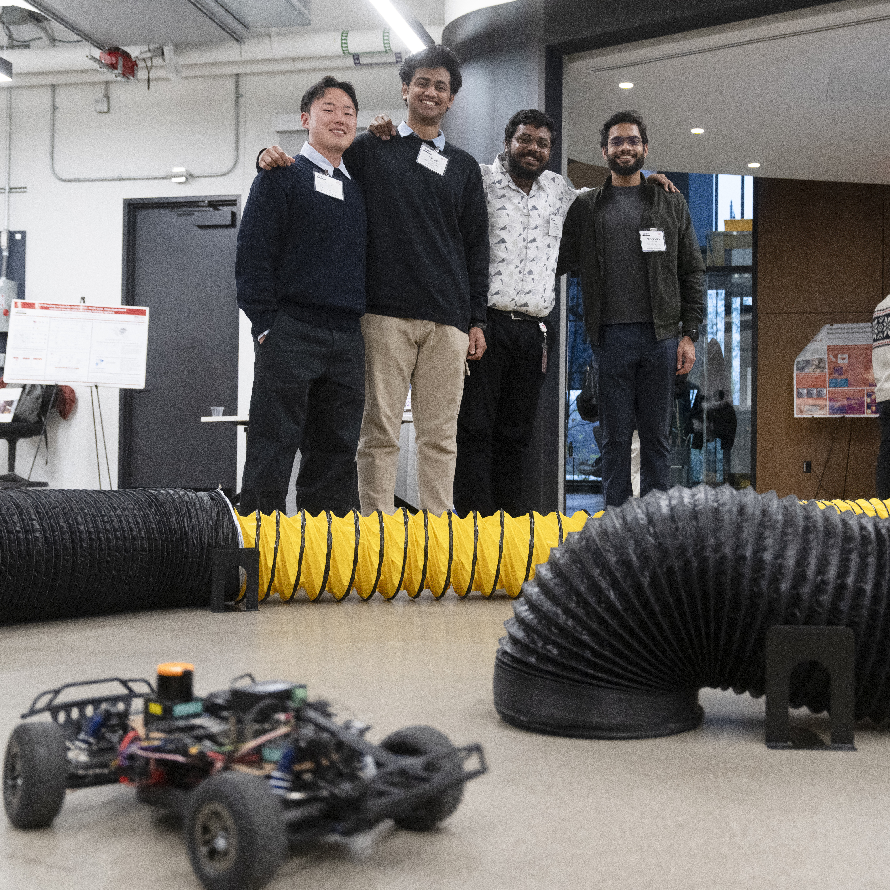
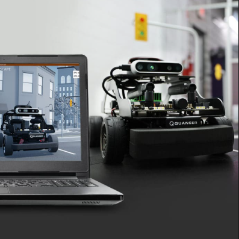
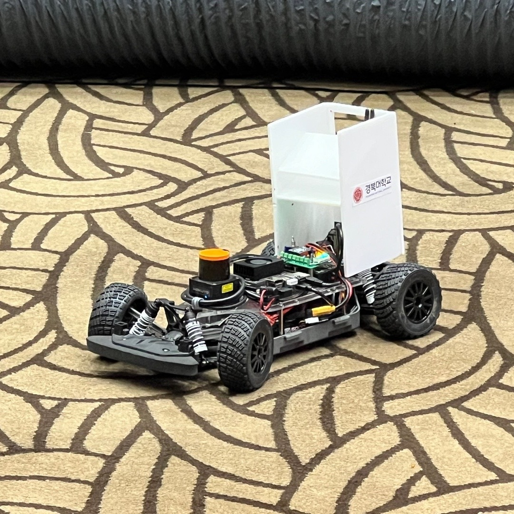
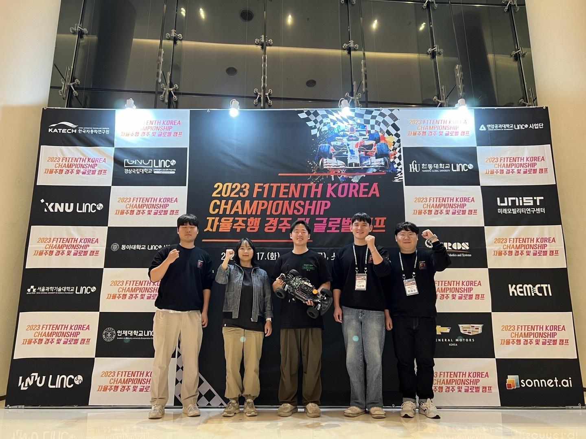
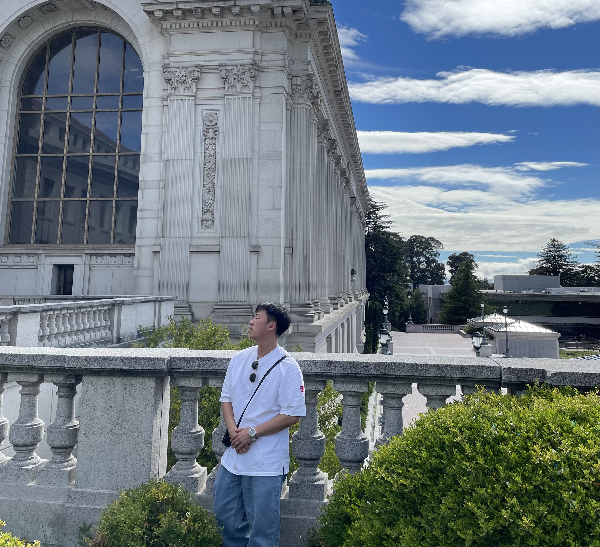
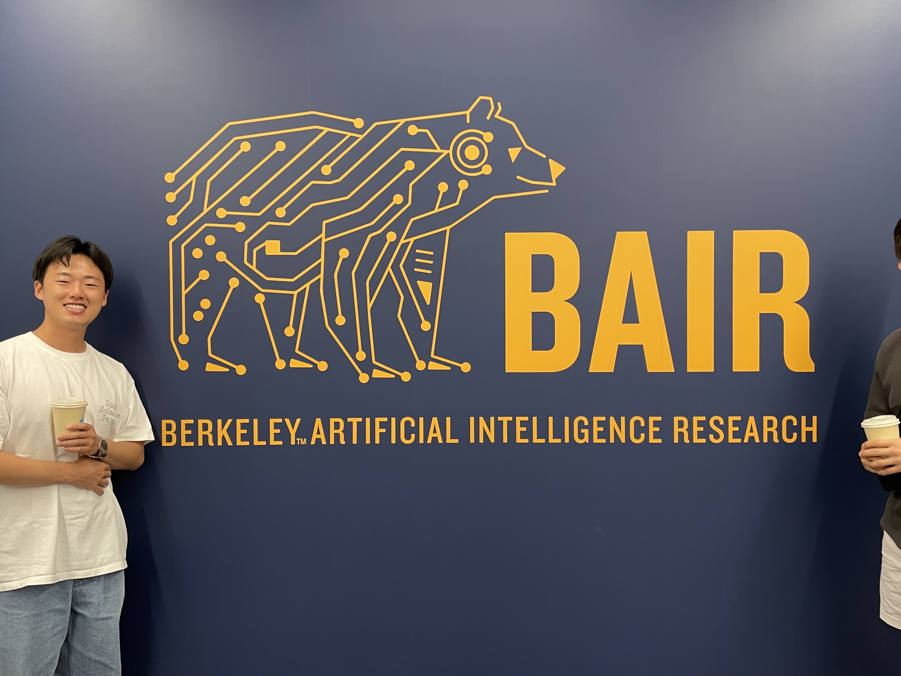

## Hi there 👋

I’m a Master’s student in Mechanical Engineering at Carnegie Mellon University. I’m currently part of the [Intelligent Control Lab](http://icontrol.ri.cmu.edu/) at the Robotics Institute, where I’m fortunate to be advised by Prof. [Changliu Liu](https://scholar.google.com/citations?user=vvzAfOwAAAAJ&hl=en). Before coming to CMU, I earned my B.S. in Mechanical Engineering from Kyungpook National University in South Korea. During my undergraduate years, I worked on autonomous driving research in the [VOICE Lab](https://sites.google.com/view/voice-lab), advised by Prof. [Kyoungseok Han](https://scholar.google.com/citations?user=CEEipNoAAAAJ&hl=en&oi=ao).

## Interests

My research interests lie at the intersection of control, machine learning, optimization, and robotics. I'm particularly interested in developing methods that enable robots to act both safely and intelligently in complex environments. Recently, my work has focused on combining safe control techniques with learning-based approaches to improve the performance and reliability of autonomous systems.

## Research
<!-- ---------------------------- Safe Koopman ----------------------------- -->
<table class="project-table" style="width: 100%; height: 180px;">
  <tr onmouseout="research3_stop()" onmouseover="research3_start()" style="border: none;">
    <td style="padding:16px 16px 16px 0; width:25%; vertical-align:middle; border: none;">
      

        

          <video width="100%" muted autoplay loop>
            <source src="assets/research/safe_koopman.mp4" type="video/mp4">
          </video>
        

        
      

    </td>
    <td style="padding:8px;width:75%;vertical-align:top; border: none;">
      

        

          <a>
            Whole-Body Safe Control of Robotic Manipulators with Koopman Neural Dynamics
          </a>
           
          

            
              <strong>Sebin Jung</strong>, Abulikemu Abuduweili, Jiaxing Li and Changliu Liu
            
             
            <em>Submitted to International Conference on Robotics and Automation(ICRA), 2026.</em>
             
            

              <!-- <a href="https://arxiv.org/pdf/2502.03132" class="btn btn-info"><strong>arXiv</strong></a> -->
              <a href="https://intelligent-control-lab.github.io/spark/" class="btn btn-info"><strong>Project Page</strong></a>
              <!-- <a href="https://www.youtube.com/watch?v=vIzeQ31YbCM" class="btn btn-info"><strong>Video</strong></a> -->
            

          

        

        

          

            We present a unified whole-body safe-control framework for robotic manipulators that replaces nominal-plus-filter pipelines with a single quadratic program powered by Koopman neural dynamics. The method learns a Koopman embedding and globally linear dynamics from data, enabling linear optimal control and hard safety enforcement for high-dimensional, nonlinear systems within one QP. To maintain feasibility near the safe-set boundary, we introduce an adversarial fine-tuning procedure for the safety index that preserves forward invariance without degrading performance. The approach reasons over link-level, distributed safety indices and integrates cleanly with a velocity-level controller.
          

        

      

    </td>
  </tr>
</table>

<!-- ---------------------------- Safe Koopman ----------------------------- -->
<!-- -------------------------------- SPARK -------------------------------- -->
<table class="project-table" style="width: 100%; height: 180px;">
  <tr onmouseout="research2_stop()" onmouseover="research2_start()" style="border: none;">
    <td style="padding:16px 16px 16px 0; width:25%; vertical-align:middle; border: none;">
      

        

          <video width="100%" muted autoplay loop>
            <source src="assets/research/spark_thumbnail.mp4" type="video/mp4">
          </video>
        

        
      

    </td>
    <td style="padding:8px;width:75%;vertical-align:top; border: none;">
      

        

          <a>
            SPARK: A Toolbox for Safe Humanoid Autonomy and Teleoperation
          </a>
           
          

            
              Yifan Sun, Rui Chen, Kai S. Yun, Yikuan Fang, <strong>Sebin Jung</strong>, Weiye Zhao and Changliu Liu
            
             
            <em>Submitted to Robotics: Science and Systems (RSS), 2025.</em>
             
            

              <a href="https://arxiv.org/pdf/2502.03132" class="btn btn-info"><strong>arXiv</strong></a>
              <a href="https://intelligent-control-lab.github.io/spark/" class="btn btn-info"><strong>Project Page</strong></a>
              <a href="https://www.youtube.com/watch?v=vIzeQ31YbCM" class="btn btn-info"><strong>Video</strong></a>
            

          

        

        

          

            SPARK is a modular toolbox designed to ensure safety in humanoid robot autonomy and teleoperation. It integrates state-of-the-art safe control methods into a flexible framework that supports safety customization across tasks and environments.
          

        

      

    </td>
  </tr>
</table>

<!-- -------------------------------- SPARK -------------------------------- -->
<!-- -------------------------------- Graduation Proj -------------------------------- -->
<table class="project-table" style="width: 100%; height: 180px;">
  <tr onmouseout="research1_stop()" onmouseover="research1_start()" style="border: none;">
    <td style="padding:16px 16px 16px 0; width:25%; vertical-align:middle; border: none;">
      

        

          <video width="100%" muted autoplay loop>
            <source src="#" type="video/mp4">
          </video>
        

        
      

    </td>
    <td style="padding:8px;width:75%;vertical-align:top; border: none;">
      

        

          <a>
            Vehicle Dynamics-Aware RL Environment Using IPG CarMaker
          </a>
           
          

            
              <strong>Sebin Jung</strong>, Junghyo Kim, Hyojae Lee and Kyoungseok Han
            
             
            <em>KNU MechE Poster Session</em>, 2025
             
            

              <!-- <a href="#" class="btn btn-primary"><strong>Project Page</strong></a> -->
              <a href="https://github.com/SBJung/graduation_project.git" class="btn btn-info"><strong>Github</strong></a>
            

          

        

        

          

            We developed a RL environment for autonomous driving using the commercial simulator IPG CarMaker, incorporating realistic vehicle dynamics. A TD3-based control policy was trained to handle continuous steering and throttle inputs. This work demonstrates the potential of learning-based driving in high-fidelity simulation and lays the foundation for future multi-agent and complex scenario extensions.
          

        

      

    </td>
  </tr>
</table>

<!-- -------------------------------- Graduation Proj -------------------------------- -->

## Projects
<!-- -------------------------------- F1Tenth Safety 21 -------------------------------- -->
<table class="project-table" style="width: 100%; height: 180px;">
  <tr onmouseout="project1_stop()" onmouseover="project1_start()" style="border: none;">
    <td style="padding:16px 16px 16px 0; width:25%; vertical-align:middle; border: none;">
      

        

          <video width="100%" muted autoplay loop>
            <source src="assets/projects/safety21.mp4" type="video/mp4">
          </video>
        

        
      

    </td>
    <td style="padding:8px;width:75%;vertical-align:top; border: none;">
      

        

          <a href="https://safety21.cmu.edu/2024-deployment-partner-consortium-symposium/">
            F1Tenth Racing Demo at Safety21
          </a>
           
          

            
              <strong>Sebin Jung</strong> with Kai S. Yun, Abhinandan Vellanki, Anirudh Shrihari, Kailash Jagadeesh, Wenli Xiao
            
             
            Pittsburgh, PA, 2024
             
            <!-- 

              <a href="#" class="btn btn-primary"><strong>Project Page</strong></a>
              <a href="https://safety21.cmu.edu/2024-deployment-partner-consortium-symposium/" class="btn btn-info"><strong>Website</strong></a>
            
 -->
          

        

        

          

            As part of the Safety21 event, our team presented a live demonstration of autonomous racing using two F1Tenth vehicles. This showcase highlighted the F1Tenth: Autonomous Racing course offered at the Carnegie Mellon Robotics Institute, led by Professor John Dolan.
          

        

      

    </td>
  </tr>
</table>

<!-- -------------------------------- F1Tenth Safety 21 -------------------------------- -->
<!-- ------------------------------- CARLA ------------------------------- -->
<table class="project-table" style="width: 100%; height: 180px;">
  <tr onmouseout="project2_stop()" onmouseover="project2_start()" style="border: none;">
    <td style="padding:16px 16px 16px 0; width:25%; vertical-align:middle; border: none;">
      

        

          <video width="100%" muted autoplay loop>
            <source src="assets/projects/carla.mp4" type="video/mp4">
          </video>
        

        
      

    </td>
    <td style="padding:8px;width:75%;vertical-align:top; border: none;">
      

        

          <a href="https://candy-train-51d.notion.site/CARLA_0-9-15-e73f6bd40f42487895586f471a56c167">
            CARLA Tutorial for Korean Students
          </a>
           
          

            
              <strong>Sebin Jung</strong>
            
             
            Daegu, South Korea, 2024
             
            

              <!-- <a href="#" class="btn btn-primary"><strong>Project Page</strong></a> -->
              <a href="https://candy-train-51d.notion.site/CARLA_0-9-15-e73f6bd40f42487895586f471a56c167" class="btn btn-info"><strong>Notion</strong></a>
            

          

        

        

          

            As a side project in the VOICE Lab, I developed a concise CARLA tutorial tailored for Korean students. The goal was to help lab members and peers quickly familiarize themselves with the simulator's core features and sensors for autonomous driving research.
          

        

      

    </td>
  </tr>
</table>

<!-- -------------------------------- CARLA -------------------------------- -->
<!-- ------------------------------- Quanser ------------------------------- -->
<table class="project-table" style="width: 100%; height: 180px;">
  <tr onmouseout="project3_stop()" onmouseover="project3_start()" style="border: none;">
    <td style="padding:16px 16px 16px 0; width:25%; vertical-align:middle; border: none;">
      

        

          <video width="100%" muted autoplay loop>
            <source src="assets/projects/quanser.mp4" type="video/mp4">
          </video>
        

        
      

    </td>
    <td style="padding:8px;width:75%;vertical-align:top; border: none;">
      

        

          <a href="https://www.quanser.com/community/student-competition-old/2024-student-self-driving-car-competition/">
            2024 ACC Quanser Self-Driving Car Student Competition
          </a>
           
          

            
              <strong>Sebin Jung</strong> with Suyong Park, Jiwoo Oh, Chanhyuk Lee, Junghyo Kim, Hyeonjeong Kim, Ginyeong Yang, Dongryeol Won
            
             
            Toronto, ON, 2024
             
            

              <!-- <a href="#" class="btn btn-primary"><strong>Project Page</strong></a> -->
              <a href="https://github.com/SBJung/2024-ACC-Quanser.git" class="btn btn-info"><strong>Code</strong></a>
            

          

        

        

          

            Our team (VOICE) competed in the 2024 ACC Quanser Self-Driving Student Competition, showcasing reliable line following using Pure Pursuit and robust traffic sign detection for stop-and-go control. After passing the qualifier, we placed 4th in the finals.
          

        

      

    </td>
  </tr>
</table>

<!-- -------------------------------- Quanser -------------------------------- -->
<!-- ------------------------------- f1tenth korea ------------------------------- -->
<table class="project-table" style="width: 100%; height: 180px;">
  <tr onmouseout="project4_stop()" onmouseover="project4_start()" style="border: none;">
    <td style="padding:16px 16px 16px 0; width:25%; vertical-align:middle; border: none;">
      

        

          <video width="100%" muted autoplay loop>
            <source src="assets/projects/f1tenth.mp4" type="video/mp4">
          </video>
        

        
      

    </td>
    <td style="padding:8px;width:75%;vertical-align:top; border: none;">
      

        

          <a href="https://korea-race23.f1tenth.org/">
            2023 ICCAS F1Tenth Korea Championship
          </a>
           
          

            
              <strong>Sebin Jung</strong> with 	Suyong Park, Yundo Choi, Hyeonjeong Kim, ChanHyuk Lee
            
             
            Yeosu, South Korea, 2023
             
            <!-- 

              <a href="#" class="btn btn-primary"><strong>Project Page</strong></a>
              <a href="https://github.com/SBJung/2024-ACC-Quanser.git" class="btn btn-info"><strong>Code</strong></a>
            
 -->
          

        

        

          

            Our team, TigerOX, competed in the 2023 ICCAS 2nd F1Tenth Korea Championship, optimizing a minimum-time raceline and implementing Pure Pursuit with adaptive velocity control.
          

        

      

    </td>
  </tr>
</table>

<!-- -------------------------------- f1tenth korea -------------------------------- -->

<!-- 
This is a [link](http://google.com). Something *italics* and something **bold**.

Here is a table

Year | Award | Category
-----|-------|--------
2014 | Emmy  | Won Outstanding Lead Actor in a miniseries or a movie
2015 | BAFTA | Nominated for Best Leading Actor for Sherlock
2014 | Satellite | Won Best Actor miniseries or television film

Here is a horizontal rule

---

Here is a blockquote

> To a great mind, nothing is little
 -->

<!-- ## Publications

1. F.Bar, J.Doe: Effects of having a placeholder of a name
2. S.Holmes, J.Watson: Consequences of living with a sociopath in London

## References

* Foo Bar: Head of Department, Placeholder Names, Lorem
* John Doe: Associate Professor, Department of Computer Science, Ipsum -->

## Recent Activities

  <button class="glider-prev">«</button>
  

    

      

        
      

      
Competed in 2nd F1Tenth Korea Championship!

    

    

      

        
      

      
Now in Berkeley for summer!

    

    

      
   
        
      

      
Visited the heart of Berkeley AI, BAIR!

    

  

  <button class="glider-next">»</button>

<!-- Glider.js init -->

