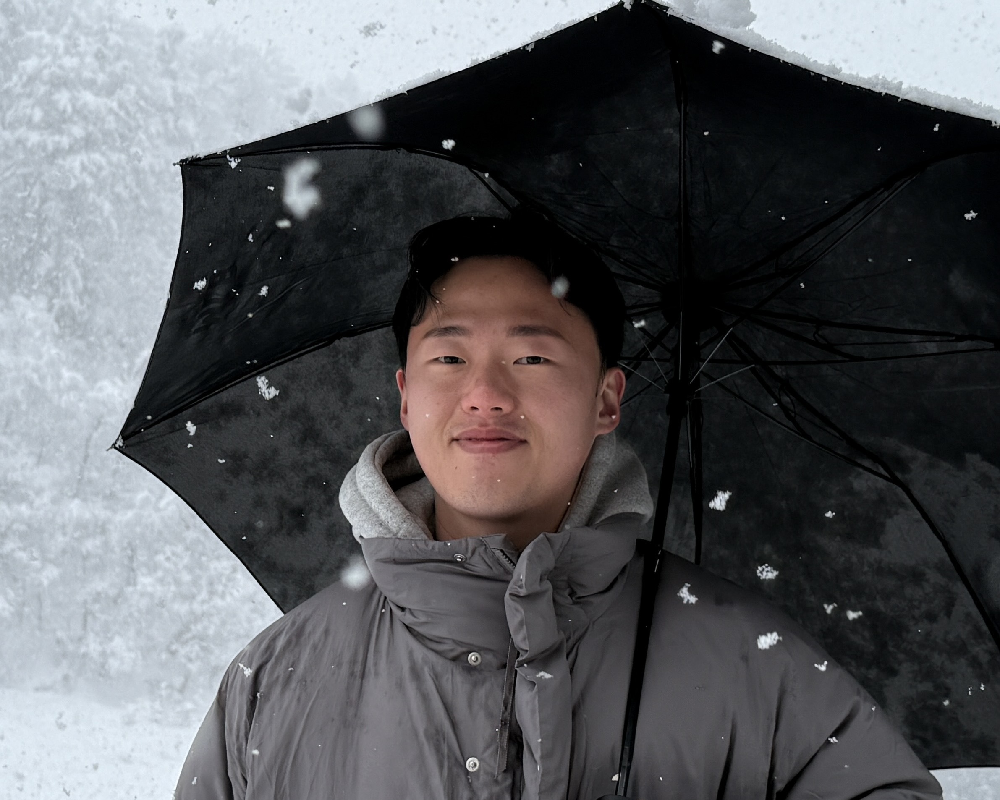
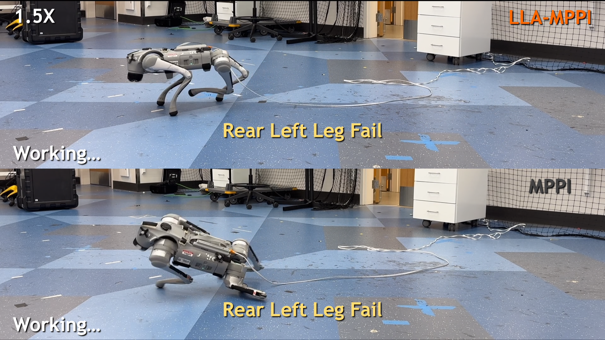
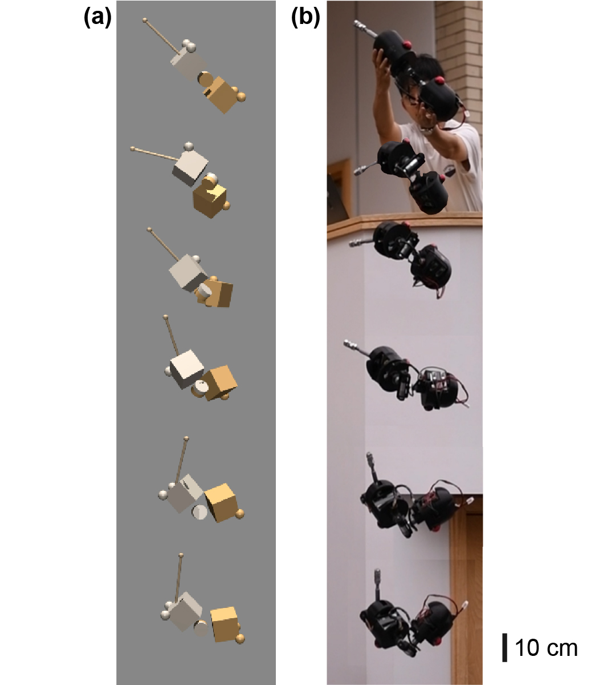
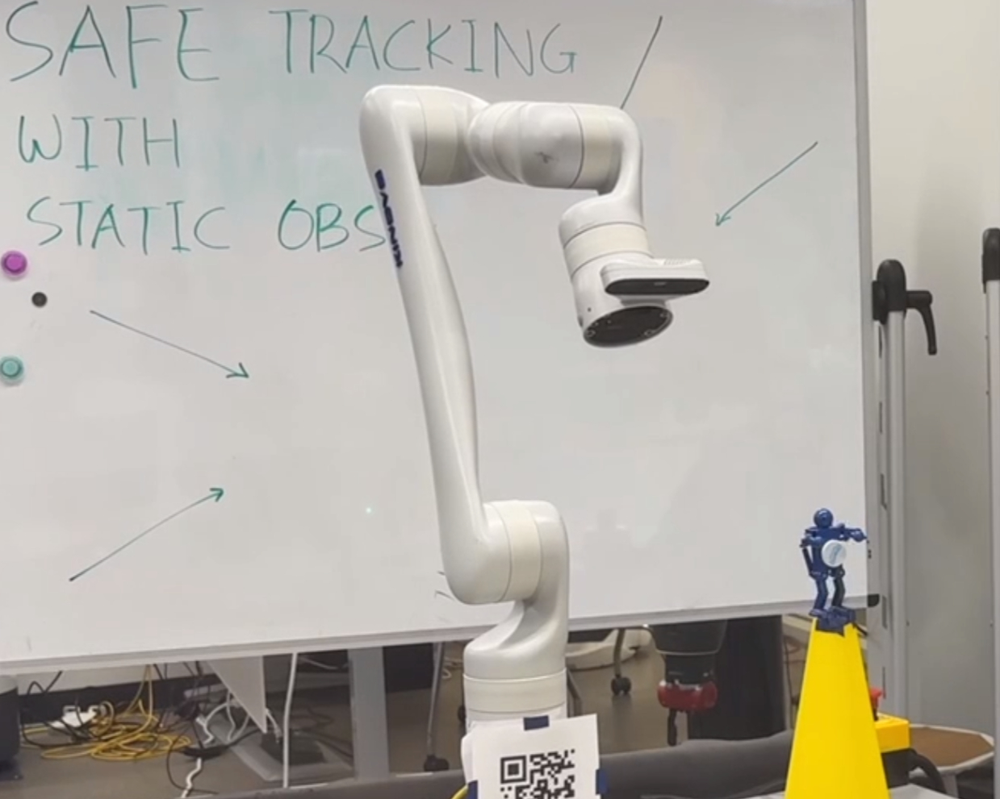
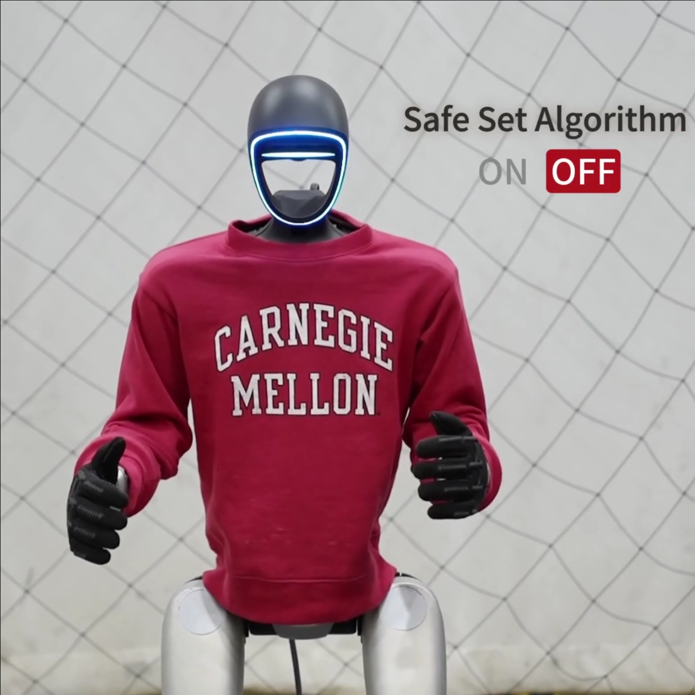
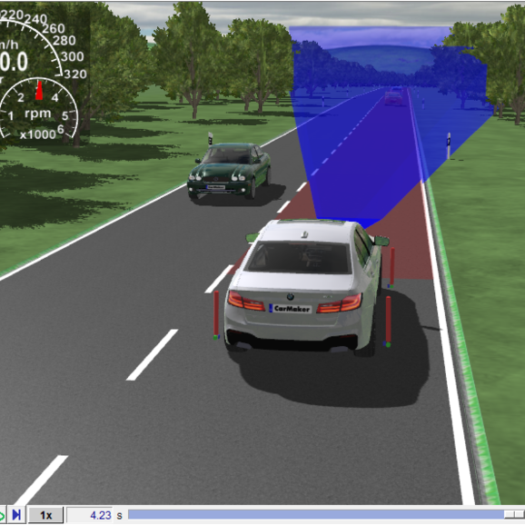
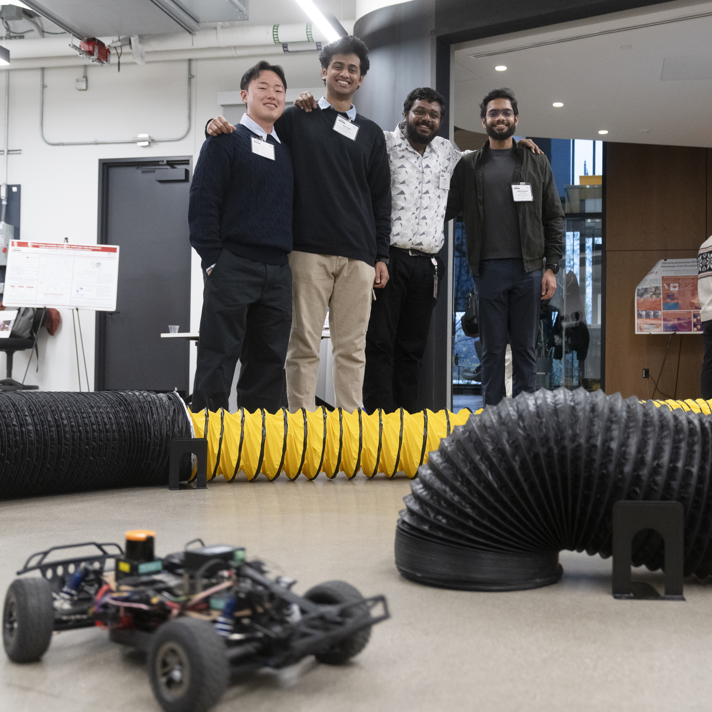
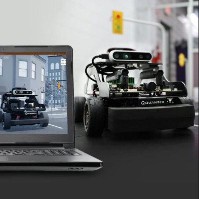
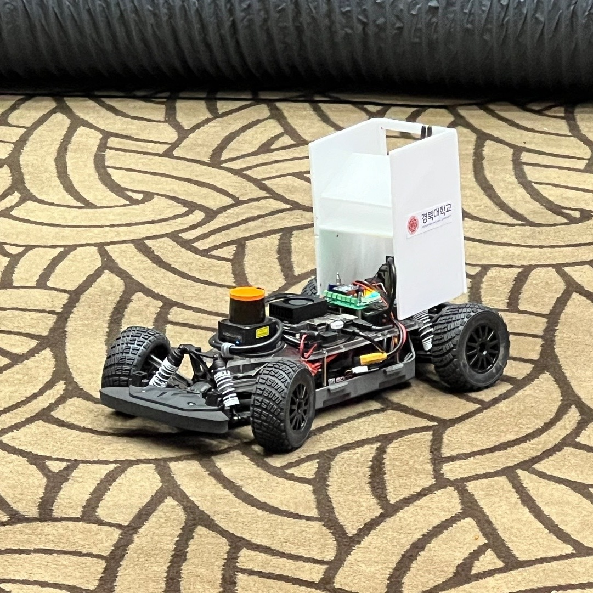

# Sebin Jung

<a href="https://www.ri.cmu.edu/ri-people/sebin-jung/">Research Assistant</a> @ CMU Robotics Institute

Hi there, welcome to my website! 

I'm currently working with Prof. [Changliu Liu](https://scholar.google.com/citations?user=vvzAfOwAAAAJ&hl=en) in the [Intelligent Control Lab](http://icontrol.ri.cmu.edu/) at Carnegie Mellon University’s [Robotics Institute](https://www.ri.cmu.edu/).

Previously, I earned my M.S. in Mechanical Engineering from Carnegie Mellon University, where I was advised by Prof. Changliu Liu and Prof. [John M. Dolan](https://scholar.google.com/citations?user=xLk_w7kAAAAJ&hl=en&oi=ao). During my master's studies, I conducted research with the Intelligent Control Lab and the [Driverless Intelligent Vehicle Lab](https://drive-lab-cmu.github.io/).

## Interests

My work as well as research interests lie at the intersection of <strong>robot learning, optimal control, and safety</strong>. My long-term goal is to develop principled, control theory-informed learning methods for adaptive, reliable, and high-performance robotic systems, bridging theoretical advances with validation on <strong>whole-body scale hardware</strong>. Please feel free to [reach out](mailto:sebinj@andrew.cmu.edu) if you’re interested in these topics or would like to collaborate!

Besides work, I love to surf, snowboard, and travel!

## News

  

  

    Sep 2026
    <strong>LLA-MPPI</strong>, <strong>Meow-Mentum</strong> paper submitted to ICRA! 📍 Pittsburgh, PA
  

  

    Jul 2026
    Started as a Research Assistant at the CMU RI! 📍 Pittsburgh, PA
  

  

    Jun 2026
    Presenting <a href="https://arxiv.org/abs/2603.03740">Whole-Body Safe Control of Robotic Systems with Koopman Neural Dynamics</a> at ICRA 2026! 📍 Vienna, Austria 🇦🇹
  

  

    May 2026
    Graduated CMU MechE with the Best Master of Science Research Paper Award! 📍 Pittsburgh, PA
  

  

    Jan 2026
    Koopman Safe Control paper accepted to ICRA (Oral)! 📍 Pittsburgh, PA
  

  

    Sep 2025
    Koopman Safe Control paper submitted to ICRA! 📍 Pittsburgh, PA
  

  

    Dec 2024
    <a href="https://arxiv.org/pdf/2502.03132">SPARK: Safe Protective and Assistive Robot Kit</a> is published! 📍 Pittsburgh, PA
  

  

    Nov 2024
    Live F1Tenth racing demo at the <a href="https://safety21.cmu.edu/2024-deployment-partner-consortium-symposium/">Safety21</a>! 📍 Pittsburgh, PA
  

  

    Oct 2024
    I joined the Intelligent Control Lab at CMU RI! 📍 Pittsburgh, PA
  

  

    Aug 2024
    I'm starting my Master's in CMU MechE! 📍 Pittsburgh, PA
  

  

    Jul 2024
    Placed 4th at the <a href="https://www.quanser.com/community/student-competition-old/2024-student-self-driving-car-competition/">ACC Quanser Self-Driving Car Student Competition</a>! 📍 Toronto, ON 🇨🇦
  

  

    Feb 2024
    Graduated KNU! 📍 Daegu, South Korea
  

  

    Dec 2023
    Received a 1st-Place Award for my <a href="https://github.com/SBJung/graduation_project">graduation project</a>! 📍 Daegu, South Korea
  

  

    Oct 2023
    I'm competing in the <a href="https://korea-race23.f1tenth.org/">2nd F1Tenth Korea Championship</a> at ICCAS. See y'all at the Championship! 📍 Yeosu, South Korea
  

  

    Jan 2023
    I joined the <a href="https://sites.google.com/view/voice-lab?pli=1&authuser=0">VOICE Lab</a>! 📍 Daegu, South Korea
  

  

    Jul 2022
    Now at UC Berkeley for summer! 📍 Berkeley, CA 🐻
  

  

## Research

(* indicates equal contribution)

<!-- ---------------------------- LLA-MPPI ----------------------------- -->
<table class="project-table research-table" style="width: 100%;">
  <tr onmouseout="research5_stop()" onmouseover="research5_start()" style="border: none;">
    <td style="padding:16px 16px 16px 0; width:25%; vertical-align:top; border: none;">
      

        

          <video width="100%" muted autoplay loop playsinline preload="auto">
            <source src="assets/research/llamppi_web.mp4" type="video/mp4">
          </video>
        

        
      

    </td>
    <td style="padding:28px 8px 8px 8px;width:75%;vertical-align:top; border: none;">
      

        

          

            LLA-MPPI: Rapidly Adaptive Whole-body Control of Legged Robots with GPU-Accelerated Parallel Simulations
            
              <strong>Sebin Jung</strong>*, Maitham F. AL-Sunni*, Juan Alvarez-Padilla, Zachary Manchester, Changliu Liu, and John M. Dolan
            
             
            <em>International Conference on Robotics and Automation (ICRA), 2027. Under Review</em>
             
             
            

              <!-- <a href="https://arxiv.org/pdf/2502.03132" class="btn btn-paper"><strong>arXiv</strong></a> -->
              <!-- <a href="https://intelligent-control-lab.github.io/spark/" class="btn btn-site"><strong>Project Page</strong></a> -->
              <!-- <a href="https://www.youtube.com/watch?v=vIzeQ31YbCM" class="btn btn-video"><strong>Video</strong></a> -->
              <button type="button" class="btn btn-abstract" onclick="toggleDetails('abstract-llamppi')"><strong>Abstract</strong></button>
            

            

              

                <strong>Abstract:</strong>
                
Real-time whole-body controllers for legged robots typically plan through a fixed nominal model and degrade when the deployed dynamics change. Existing adaptive methods either require model structure that contact dynamics do not provide or need offline training for each anticipated condition. We present <strong>Look-back and Look-ahead Adaptive Model Predictive Path Integral control (LLA-MPPI)</strong>. The method instead converts whole-body adaptation into selection over a bank of GPU-batched contact simulators with different physical or structural parameters. Windowed prediction errors select the simulator that best explains recent motion. A whole-body MPPI planner then optimizes controls through the selected model. The framework requires no offline training and its identified parameters remain physical quantities. Across four simulated tasks it achieves 97.5% success while the strongest baseline reaches 74% and an oracle given the true model reaches 98.5%. Hardware experiments on a Unitree Go2 show the robot walking under a payload added mid-run, walking after one leg is disabled, and pushing a box to its goal while the box mass is increased on the fly.

              

            

          

        

      

    </td>
  </tr>
</table>

<!-- ---------------------------- LLA-MPPI ----------------------------- -->
<!-- ---------------------------- Meow-Mentum ----------------------------- -->
<table class="project-table research-table" style="width: 100%;">
  <tr onmouseout="research4_stop()" onmouseover="research4_start()" style="border: none;">
    <td style="padding:16px 16px 16px 0; width:25%; vertical-align:top; border: none;">
      

        

          <video width="100%" muted autoplay loop>
            <source src="#" type="video/mp4">
          </video>
        

        
      

    </td>
    <td style="padding:28px 8px 8px 8px;width:75%;vertical-align:top; border: none;">
      

        

          

            Meow-Mentum: A Multi-Strategy Aerial Self-Righting Robot for Evaluating the Contribution of an Actuated Tail Across Fall Conditions
            
              Seokhyun Kim, Jin Woo Hwang, Itak Choi, Chan Kyu Lee, Kunwoo Lee, <strong>Sebin Jung</strong>, Avery Williamson and Victoria Webster-Wood
            
             
            <em>International Conference on Robotics and Automation (ICRA), 2027. Under Review</em>
             
             
            

              <!-- <a href="https://arxiv.org/pdf/2502.03132" class="btn btn-paper"><strong>arXiv</strong></a> -->
              <!-- <a href="https://intelligent-control-lab.github.io/spark/" class="btn btn-site"><strong>Project Page</strong></a> -->
              <!-- <a href="https://www.youtube.com/watch?v=vIzeQ31YbCM" class="btn btn-video"><strong>Video</strong></a> -->
              <button type="button" class="btn btn-abstract" onclick="toggleDetails('abstract-meow')"><strong>Abstract</strong></button>
            

            

              

                <strong>Abstract:</strong>
                
Robots operating in unstructured environments may fall or overturn, and recovering an upright posture is critical for sustained operation. Inspired by the feline righting reflex, in which coordinated body and tail motions contribute to aerial reorientation, this work investigates the role of spine and tail actuation in aerial self-righting. We hypothesized that adding an actuated tail improves self-righting performance despite its added mass and mechanical complexity. To evaluate this hypothesis, we present <strong>Meow-Mentum</strong>, a 1.86 kg self-righting robot that combines a two-degree-of-freedom (2-DoF) actuated spine with a one-degree-of-freedom (1-DoF) actuated tail, using onboard sensing and closed-loop control. Reinforcement learning-based controllers were trained in a physics simulator and deployed zero-shot on the physical robot. <strong>Meow-Mentum</strong> achieved feet-down orientation within 1 m of free fall from a range of initial orientations. With active spine motion in both morphologies, we compared the matched tail and no-tail configurations across pitch and roll release conditions. Adding tail actuation improved self-righting performance overall and across roll releases, while its additional benefit across pitch releases was less clear. These results indicate that the contribution of tail actuation to self-righting depends on the initial release orientation.

              

            

          

        

      

    </td>
  </tr>
</table>

<!-- ---------------------------- Meow-Mentum ----------------------------- -->
<!-- ---------------------------- Safe Koopman ----------------------------- -->
<table class="project-table research-table" style="width: 100%;">
  <tr onmouseout="research3_stop()" onmouseover="research3_start()" style="border: none;">
    <td style="padding:16px 16px 16px 0; width:25%; vertical-align:top; border: none;">
      

        

          <video width="100%" muted autoplay loop>
            <source src="assets/research/safe_koopman.mp4" type="video/mp4">
          </video>
        

        
      

    </td>
    <td style="padding:28px 8px 8px 8px;width:75%;vertical-align:top; border: none;">
      

        

          

            Whole-Body Safe Control of Robotic Systems with Koopman Neural Dynamics
            
              <strong>Sebin Jung</strong>, Abulikemu Abuduweili, Jiaxing Li and Changliu Liu
            
             
            <em>International Conference on Robotics and Automation (ICRA), 2026. <strong class="oral">Oral Presentation</strong></em>
             
             
            

              <a href="https://arxiv.org/abs/2603.03740" class="btn btn-paper"><strong>arXiv</strong></a>
              <a href="https://sbjung.github.io/website_safe_koopman/" class="btn btn-site"><strong>Website</strong></a>
              <!-- <a href="https://www.youtube.com/watch?v=vIzeQ31YbCM" class="btn btn-video"><strong>Video</strong></a> -->
              <button type="button" class="btn btn-abstract" onclick="toggleDetails('abstract-koopman')"><strong>Abstract</strong></button>
              <button type="button" class="btn btn-cite" onclick="toggleDetails('cite-koopman')"><strong>Cite</strong></button>
            

            

            

              <strong>Abstract:</strong>
              
Controlling robots with strongly nonlinear, high-dimensional dynamics remains challenging, as direct nonlinear optimization with safety constraints is often intractable in real time. The Koopman operator offers a way to represent nonlinear systems linearly in a lifted space, enabling the use of efficient linear control. We propose a data-driven framework that learns a Koopman embedding and operator from data, and integrates the resulting linear model with the Safe Set Algorithm (SSA). This allows the tracking and safety constraints to be solved in a single quadratic program (QP), ensuring feasibility and optimality without a separate safety filter. We validate the method on a Kinova Gen3 manipulator and a Go2 quadruped, showing accurate tracking and obstacle avoidance.

            

            

              <strong>Citation Formats:</strong>
              <select id="citation-format-koopman" onchange="updateCitation('koopman')">
                <option value="bibtex">BibTeX</option>
                <option value="plaintext">Plain Text</option>
              </select>
              <pre id="citation-bibtex-koopman">@misc{jung2026wholebodysafecontrolrobotic,
                title = {Whole-Body Safe Control of Robotic Systems with Koopman Neural Dynamics},
                author = {Sebin Jung and Abulikemu Abuduweili and Jiaxing Li and Changliu Liu},
                year = {2026},
                eprint = {2603.03740},
                archivePrefix = {arXiv},
                primaryClass = {cs.RO},
                url = {https://arxiv.org/abs/2603.03740}
              }</pre>
              <pre id="citation-plaintext-koopman" style="display: none;">S. Jung, A. Abuduweili, J. Li and C. Liu, "Whole-Body Safe Control of Robotic Systems with Koopman Neural Dynamics," arXiv:2603.03740, 2026.</pre>
            

            

          

        

      

    </td>
  </tr>
</table>

<!-- ---------------------------- Safe Koopman ----------------------------- -->
<!-- -------------------------------- SPARK -------------------------------- -->
<table class="project-table research-table" style="width: 100%;">
  <tr onmouseout="research2_stop()" onmouseover="research2_start()" style="border: none;">
    <td style="padding:16px 16px 16px 0; width:25%; vertical-align:top; border: none;">
      

        

          <video width="100%" muted autoplay loop>
            <source src="assets/research/spark_thumbnail.mp4" type="video/mp4">
          </video>
        

        
      

    </td>
    <td style="padding:28px 8px 8px 8px;width:75%;vertical-align:top; border: none;">
      

        

          

            SPARK: Safe Protective and Assistive Robot Kit
            
              Yifan Sun, Rui Chen, Kai S Yun, Yikuan Fang, <strong>Sebin Jung</strong>, Feihan Li, Bowei Li, Weiye Zhao and Changliu Liu
            
             
            <em>IFAC Symposium on Robotics, 2025.</em>
             
             
            

              <a href="https://arxiv.org/pdf/2502.03132" class="btn btn-paper"><strong>arXiv</strong></a>
              <a href="https://github.com/intelligent-control-lab/spark" class="btn btn-code"><strong>Code</strong></a>
              <a href="https://intelligent-control-lab.github.io/spark/" class="btn btn-site"><strong>Website</strong></a>
              <a href="https://www.youtube.com/watch?v=vIzeQ31YbCM" class="btn btn-video"><strong>Video</strong></a>
              <button type="button" class="btn btn-abstract" onclick="toggleDetails('abstract-spark')"><strong>Abstract</strong></button>
              <button type="button" class="btn btn-cite" onclick="toggleDetails('cite-spark')"><strong>Cite</strong></button>
            

            

            

              <strong>Abstract:</strong>
              
This paper introduces the Safe Protective and Assistive Robot Kit (SPARK), a comprehensive benchmark designed to ensure safety in humanoid autonomy and teleoperation. Humanoid robots pose significant safety risks due to their physical capabilities of interacting with complex environments. The physical structures of humanoid robots further add complexity to the design of general safety solutions. To facilitate the safe deployment of complex robot systems, SPARK can be used as a toolbox that comes with state-of-the-art safe control algorithms in a modular and composable robot control framework. Users can easily configure safety criteria and sensitivity levels to optimize the balance between safety and performance. To accelerate humanoid safety research and development, SPARK provides a simulation benchmark that compares safety approaches in a variety of environments, tasks, and robot models. Furthermore, SPARK allows quick deployment of synthesized safe controllers on real robots. For hardware deployment, SPARK supports Apple Vision Pro (AVP) or a Motion Capture System as external sensors, while also offering interfaces for seamless integration with alternative hardware setups. This paper demonstrates SPARK’s capability with both simulation experiments and case studies with a Unitree G1 humanoid robot. Leveraging these advantages of SPARK, users and researchers can significantly improve the safety of their humanoid systems as well as accelerate relevant research.

            

            

              <strong>Citation Formats:</strong>
              <select id="citation-format-spark" onchange="updateCitation('spark')">
                <option value="bibtex">BibTeX</option>
                <option value="plaintext">Plain Text</option>
              </select>
              <pre id="citation-bibtex-spark">@inproceedings{sun2025spark,
                title = {SPARK: Safe Protective and Assistive Robot Kit},
                author = {Sun, Yifan and Chen, Rui and Yun, Kai S and Fang, Yikuan and Jung, Sebin and Li, Feihan and Li, Bowei and Zhao, Weiye and Liu, Changliu},
                booktitle = {IFAC Symposium on Robotics},
                year = {2025},
                url = {https://arxiv.org/pdf/2502.03132}
              }</pre>
              <pre id="citation-plaintext-spark" style="display: none;">Y. Sun, R. Chen, K. Yun, Y. Fang, S. Jung, F. Li, B. Li, W. Zhao and C. Liu, "SPARK: Safe Protective and Assistive Robot Kit" in IFAC Symposium on Robotics, 2025.</pre>
            

            

          

        

      

    </td>
  </tr>
</table>

<!-- -------------------------------- SPARK -------------------------------- -->
<!-- -------------------------------- Graduation Proj -------------------------------- -->
<table class="project-table research-table" style="width: 100%;">
  <tr onmouseout="research1_stop()" onmouseover="research1_start()" style="border: none;">
    <td style="padding:16px 16px 16px 0; width:25%; vertical-align:top; border: none;">
      

        

          <video width="100%" muted autoplay loop>
            <source src="#" type="video/mp4">
          </video>
        

        
      

    </td>
    <td style="padding:28px 8px 8px 8px;width:75%;vertical-align:top; border: none;">
      

        

          

            Vehicle Dynamics-Aware RL Environment Using IPG CarMaker
            
              <strong>Sebin Jung</strong>, Junghyo Kim, Hyojae Lee and Kyoungseok Han
            
             
            <em>KNU MechE Poster Session</em>, 2024.
             
             
            

              <!-- <a href="#" class="btn btn-primary"><strong>Project Page</strong></a> -->
              <a href="https://github.com/SBJung/graduation_project.git" class="btn btn-code"><strong>Code</strong></a>
            

          

        

      

    </td>
  </tr>
</table>

<!-- -------------------------------- Graduation Proj -------------------------------- -->

## Projects
<!-- -------------------------------- F1Tenth Safety 21 -------------------------------- -->
<table class="project-table" style="width: 100%;">
  <tr onmouseout="project1_stop()" onmouseover="project1_start()" style="border: none;">
    <td style="padding:16px 16px 16px 0; width:25%; vertical-align:top; border: none;">
      

        

          <video width="100%" muted autoplay loop>
            <source src="assets/projects/safety21.mp4" type="video/mp4">
          </video>
        

        
      

    </td>
    <td style="padding:16px 8px 8px 8px;width:75%;vertical-align:top; border: none;">
      

        

          

            F1Tenth Racing Demo at Safety21
            
              <strong>Sebin Jung</strong> with Kai S. Yun, Abhinandan Vellanki, Anirudh Shrihari, Kailash Jagadeesh, Wenli Xiao
            
             
            Pittsburgh, PA, 2024
             
            

              <a href="https://safety21.cmu.edu/2024-deployment-partner-consortium-symposium/" class="btn btn-site"><strong>Website</strong></a>
            

          

        

        

          

            As part of the Safety21 event, our team presented a live demonstration of autonomous racing using two F1Tenth vehicles. This showcase highlighted the F1Tenth: Autonomous Racing course offered at the Carnegie Mellon Robotics Institute, led by Professor John Dolan.
          

        

      

    </td>
  </tr>
</table>

<!-- -------------------------------- F1Tenth Safety 21 -------------------------------- -->
<!-- ------------------------------- CARLA ------------------------------- -->
<table class="project-table" style="width: 100%;">
  <tr onmouseout="project2_stop()" onmouseover="project2_start()" style="border: none;">
    <td style="padding:16px 16px 16px 0; width:25%; vertical-align:top; border: none;">
      

        

          <video width="100%" muted autoplay loop>
            <source src="assets/projects/carla.mp4" type="video/mp4">
          </video>
        

        
      

    </td>
    <td style="padding:16px 8px 8px 8px;width:75%;vertical-align:top; border: none;">
      

        

          

            CARLA Tutorial for Korean Students
            
              <strong>Sebin Jung</strong>
            
             
            Daegu, South Korea, 2024
             
            

              <!-- <a href="#" class="btn btn-primary"><strong>Project Page</strong></a> -->
              <a href="https://candy-train-51d.notion.site/CARLA_0-9-15-e73f6bd40f42487895586f471a56c167" class="btn btn-site"><strong>Website</strong></a>
            

          

        

        

          

            As a side project in the VOICE Lab, I developed a concise CARLA tutorial tailored for Korean students. The goal was to help lab members and peers quickly familiarize themselves with the simulator's core features and sensors for autonomous driving research.
          

        

      

    </td>
  </tr>
</table>

<!-- -------------------------------- CARLA -------------------------------- -->
<!-- ------------------------------- Quanser ------------------------------- -->
<table class="project-table" style="width: 100%;">
  <tr onmouseout="project3_stop()" onmouseover="project3_start()" style="border: none;">
    <td style="padding:16px 16px 16px 0; width:25%; vertical-align:top; border: none;">
      

        

          <video width="100%" muted autoplay loop>
            <source src="assets/projects/quanser.mp4" type="video/mp4">
          </video>
        

        
      

    </td>
    <td style="padding:16px 8px 8px 8px;width:75%;vertical-align:top; border: none;">
      

        

          

            2024 ACC Quanser Self-Driving Car Student Competition
            
              <strong>Sebin Jung</strong> with Suyong Park, Jiwoo Oh, Chanhyuk Lee, Junghyo Kim, Hyeonjeong Kim, Ginyeong Yang, Dongryeol Won
            
             
            Toronto, ON, 2024
             
            

              <!-- <a href="#" class="btn btn-primary"><strong>Project Page</strong></a> -->
              <a href="https://github.com/SBJung/2024-ACC-Quanser.git" class="btn btn-code"><strong>Code</strong></a>
              <a href="https://www.quanser.com/community/student-competition-old/2024-student-self-driving-car-competition/" class="btn btn-site"><strong>Website</strong></a>
            

          

        

        

          

            Our team (VOICE) competed in the 2024 ACC Quanser Self-Driving Student Competition, showcasing reliable line following using Pure Pursuit and robust traffic sign detection for stop-and-go control. After passing the qualifier, we placed 4th in the finals.
          

        

      

    </td>
  </tr>
</table>

<!-- -------------------------------- Quanser -------------------------------- -->
<!-- ------------------------------- f1tenth korea ------------------------------- -->
<table class="project-table" style="width: 100%;">
  <tr onmouseout="project4_stop()" onmouseover="project4_start()" style="border: none;">
    <td style="padding:16px 16px 16px 0; width:25%; vertical-align:top; border: none;">
      

        

          <video width="100%" muted autoplay loop>
            <source src="assets/projects/f1tenth.mp4" type="video/mp4">
          </video>
        

        
      

    </td>
    <td style="padding:16px 8px 8px 8px;width:75%;vertical-align:top; border: none;">
      

        

          

            2023 ICCAS F1Tenth Korea Championship
            
              <strong>Sebin Jung</strong> with 	Suyong Park, Yundo Choi, Hyeonjeong Kim, ChanHyuk Lee
            
             
            Yeosu, South Korea, 2023
             
            

              <!-- <a href="#" class="btn btn-primary"><strong>Project Page</strong></a> -->
              <a href="https://korea-race23.f1tenth.org/" class="btn btn-site"><strong>Website</strong></a>
            

          

        

        

          

            Our team, TigerOX, competed in the 2023 ICCAS 2nd F1Tenth Korea Championship, optimizing a minimum-time raceline and implementing Pure Pursuit with adaptive velocity control.
          

        

      

    </td>
  </tr>
</table>

<!-- -------------------------------- f1tenth korea -------------------------------- -->

<!-- 
This is a [link](http://google.com). Something *italics* and something **bold**.

Here is a table

Year | Award | Category
-----|-------|--------
2014 | Emmy  | Won Outstanding Lead Actor in a miniseries or a movie
2015 | BAFTA | Nominated for Best Leading Actor for Sherlock
2014 | Satellite | Won Best Actor miniseries or television film

Here is a horizontal rule

---

Here is a blockquote

> To a great mind, nothing is little
 -->

<!-- ## Publications

1. F.Bar, J.Doe: Effects of having a placeholder of a name
2. S.Holmes, J.Watson: Consequences of living with a sociopath in London

## References

* Foo Bar: Head of Department, Placeholder Names, Lorem
* John Doe: Associate Professor, Department of Computer Science, Ipsum -->
